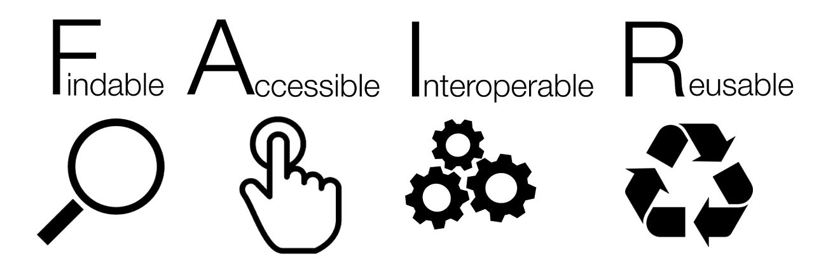
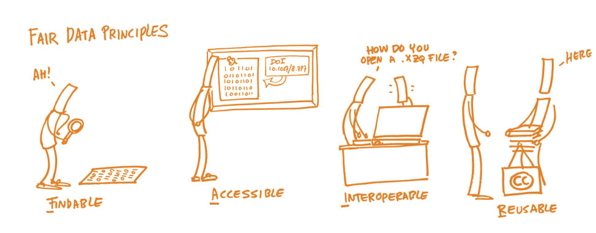
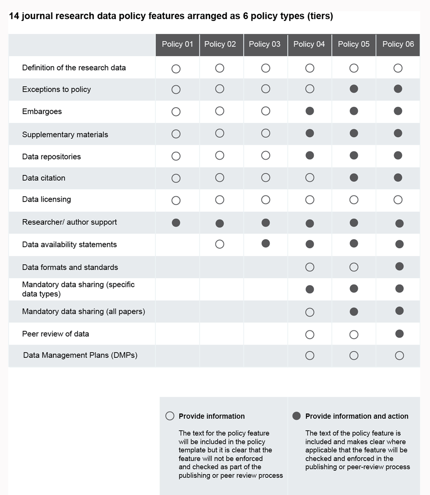

# _Data sharing_ : trouver, réutiliser et citer des données de recherche

## Sommaire

_Les liens ne sont pas cliquables dans le fichier PDF._

<!-- MDTOC maxdepth:3 firsth1:0 numbering:0 flatten:0 bullets:1 updateOnSave:1 -->

- [Sommaire](#sommaire)   
- [1. Introduction](#1-introduction)   
   - [Que sont pour vous les "données de recherche" et comment les partagez-vous?](#que-sont-pour-vous-les-données-de-recherche-et-comment-les-partagez-vous)   
   - [Modes de partage des données de recherche](#modes-de-partage-des-données-de-recherche)   
   - [Terminologie](#terminologie)   
      - [Données de recherche](#données-de-recherche)   
      - [Entrepôt de données](#entrepôt-de-données)   
   - [Enjeux](#enjeux)   
- [2. Comment chercher des données de recherche?](#2-comment-chercher-des-données-de-recherche)   
   - [Méthode 1, fonctionnalités intégrées aux bases bibliographiques](#méthode-1-fonctionnalités-intégrées-aux-bases-bibliographiques)   
   - [Méthode 2, les outils de recherche spécialisés](#méthode-2-les-outils-de-recherche-spécialisés)   
      - [DataCite Search](#datacite-search)   
      - [Mendeley data search](#mendeley-data-search)   
      - [Google dataset search](#google-dataset-search)   
      - [Dimensions](#dimensions)   
      - [Autres services](#autres-services)   
   - [Méthode 3, interroger directement un entrepôt de données](#méthode-3-interroger-directement-un-entrepôt-de-données)   
   - [Quelle démarche pour identifier un entrepôt de données approprié?](#quelle-démarche-pour-identifier-un-entrepôt-de-données-approprié)   
      - [Suivre les pratiques de votre communauté](#suivre-les-pratiques-de-votre-communauté)   
      - [Suivre les recommandations ou obligations](#suivre-les-recommandations-ou-obligations)   
      - [Identifier des critères importants et les hiérarchiser](#identifier-des-critères-importants-et-les-hiérarchiser)   
      - [Trouver un entrepôt de données avec re3data](#trouver-un-entrepôt-de-données-avec-re3data)   
      - [Outils complémentaires](#outils-complémentaires)   
   - [TP1, trouver des entrepôts de données](#tp1-trouver-des-entrepôts-de-données)   
- [3. Trouver des jeux de données existants](#3-trouver-des-jeux-de-données-existants)   
   - [Réutiliser des données?](#réutiliser-des-données)   
   - [TP2, trouver et évaluer un jeu de données](#tp2-trouver-et-évaluer-un-jeu-de-données)   
   - [Focus sur les principes FAIR](#focus-sur-les-principes-fair)   
      - [Comprendre et appliquer les principes FAIR](#comprendre-et-appliquer-les-principes-fair)   
      - [Données FAIR et ouvertes?](#données-fair-et-ouvertes)   
- [4. Citer des données de recherche](#4-citer-des-données-de-recherche)   
   - [Citation en bibliographie](#citation-en-bibliographie)   
      - [Comment citer un jeu de données?](#comment-citer-un-jeu-de-données)   
   - [Data availability statement](#data-availability-statement)   
- [5. Politiques de données des éditeurs et des organismes de financement de la recherche](#5-politiques-de-données-des-éditeurs-et-des-organismes-de-financement-de-la-recherche)   
   - [Editeurs](#editeurs)   
   - [Organismes de financement](#organismes-de-financement)   
- [6. Conclusion](#6-conclusion)   
   - [Rappel des enjeux, en image](#rappel-des-enjeux-en-image)   
   - [La grande image de la science ouverte](#la-grande-image-de-la-science-ouverte)   

<!-- /MDTOC -->

## 1. Introduction

### Que sont pour vous les "données de recherche" et comment les partagez-vous?

![exe][exe] Nous prenons quelques minutes pour préparer ce tour de table.

1. Pouvez-vous réfléchir à propos du dernier article que vous avez lu/écrit : quel était le matériel supplémentaire (tableaux, figures, etc.)?

2. Pouvez-vous noter des **exemples** et des types de données de recherche pertinents pour votre domaine de recherche?

3. Quels **modes de partage** des fichiers de données sont-ils utilisés dans votre domaine?

### Modes de partage des données de recherche

Détaillons les modes de partage des données, pour synthétiser les atouts et les limites de chacun d'eux.

| Méthode       | Avantage     | Inconvénient     |
| :------------- | :---------- | ----------- |
|  Publier les données sur un **site web** (d'un projet, d'un laboratoire, etc.) | Les données sont facilement accessibles pour les autres    Dissémination plus large de la recherche  | Requiert une maintenance de la part du groupe de recherche    Pas de contrôle sur qui accède aux données    Incapacité à attribuer un DOI ou un autre identifiant pérenne au jeu de données   |
| Soumettre les données à une **revue** ou publier un **article de données** ou _data paper_ 	| Les données sont associées à l'article publié au sujet de ces données    Les données sont partagées avec les pairs | Les données peuvent ne pas donner lieu à un article mais devoir quand même être partagées    En fonction de la revue, l'accès peut être restreint aux chercheurs bénéficiant d'un abonnement à la revue|
| Répondre aux **demandes** de données 	| Conserver le contrôle sur qui utilise les données 	| Accès très limité aux données    Peut ne pas être une méthode acceptable pour les agences de financement    Peut être chronophage	|
| Déposer les données dans un **entrepôt de données** | En fonction des entrepôts, accès paramétrable : fermé >> restreint >> sous embargo >> ouvert    Ne requiert aucune maintenance par le groupe de recherche    Capacité à attribuer un DOI ou un autre identifiant pérenne au jeu de données    Les données sont partagées avec les pairs | Les limitations peuvent varier en fonction des entrepôts : soumission limitée à certains utilisateurs, soumission payante, nécessité de respecter un format de données et/ou de métadonnées, etc. |

Adapté de : Llebot, C. (s. d.). _Research Data Services : Sharing Your Data_. Oregon State University Libraries. https://guides.library.oregonstate.edu/research-data-services/data-sharing

![fleche][fleche] Pour la suite de l'atelier, nous allons surtout considérer les **entrepôts de données**.

### Terminologie

Avant de poursuivre, fixons quelques éléments de terminologie.

#### Données de recherche

> **Data**
>
> Data in the sense used here are all digitally available objects (simple or complex) that emerge or are the result of the research process.

_On entend ici par données tous les objets (simples ou complexes) disponibles sous forme numérique qui émergent ou sont le résultat du processus de recherche._

#### Entrepôt de données

> **Repository**
>
> Repository is defined as the infrastructure and corresponding service that allows for the persistent, efficient and sustainable storage of digital objects (such as documents, data and code).

_Un entrepôt est défini comme l'infrastructure et le service correspondant qui permet le stockage persistant, fiable et durable des objets numériques (tels que les documents, les données et le code)._

Ces deux définitions sont tirées du [glossaire](https://book.fosteropenscience.eu/en/06Glossary/) du livre suivant.

Bezjak, S., Clyburne-Sherin, A., Conzett, P., Fernandes, P. L., Görögh, E., Helbig, K., Kramer, B., Labastida, I., Niemeyer, K., Psomopoulos, F., Ross-Hellauer, T., Schneider, R., Tennant, J., Verbakel, E., Brinken, H., & Heller, L. (2018). _Open Science Training Handbook_. FOSTER Plus Consortium. https://book.fosteropenscience.eu/

### Enjeux
![question][quest] Quizz 1 : enjeux du partage des données de recherche

## 2. Comment chercher des données de recherche?

![question][quest] Comment procédez-vous actuellement pour chercher des donnés existantes?

On peut distinguer au moins 3 méthodes.

* Méthode 1 : utiliser les fonctionnalités intégrées aux **bases de données bibliographiques**, par exemple Scopus et PubMed.
* Méthode 2 : interroger les **outils de recherche spécialisés** qu'il s'agisse de moteurs de recherche comme DataCite Search ou d'index de base de données (Data Index du Web of Science).
* Méthode 3 : utiliser les **entrepôts de données**, **généralistes**  (tels que Zenodo, Dryad ou Figshare) ou **spécialisés** (tels que Harvard Dataverse ou 4TU.ResearchData).

### Méthode 1, fonctionnalités intégrées aux bases bibliographiques

En plus du _data availability statement_ (parfois non accessible sans abonnement à la revue), des outils intégrés aux bases de données bibliographiques permettent d'identifier les jeux de données **liés à des publications**.

Dans la nouvelle interface de **[PubMed](https://www.ncbi.nlm.nih.gov/pubmed/?otool=ifruvsblib)**, il s'agit de l'attribut _Associated data_, disponible sous la forme d'un filtre à partir d'une liste de résultats.

Dans **[Scopus](http://docelec.u-bordeaux.fr/login?url=http://www.scopus.com)**, il s'agit de l'encart _Related Research Data_, accessible depuis la notice d'un article en particulier. Cette fonctionnalité est donc très limitée, puisqu'elle ne permet pas de sélectionner un ensemble d'articles ayant des données associées.

Le **type de publication** peut également être exploité comme critère de recherche ou de filtre. Il permet en effet d'identifier les articles de données, ou _data papers_. Les valeurs associées diffèrent en fonction des bases de données.
* Scopus -> choisir la valeur _data paper_
* PubMed -> choisir la valeur _dataset_

###  Méthode 2, les outils de recherche spécialisés

Certains des services suivants indexent uniquement des données de recherche, d'autres non.

![roue][roue]

#### DataCite Search

URL : https://search.datacite.org

Fournisseur du service : l'organisation à but non lucratif DataCite - ses membres sont des organismes de recherche, des universités, des sociétés savantes, des fournisseurs de service, etc.

##### Couverture

DataCite Search permet de chercher parmi tous les objets auxquels un DOI a été attribué par DataCite. La couverture excède celle des données de recherche, car DataCite fournit à des organismes de recherche des DOI pour toutes leurs productions, qu'il s'agisse de données de recherche ou de thèses, de preprints, etc.

[Consulter la liste des entrepôts de données interrogeables par DataCite Search](https://search.datacite.org/repositories)

##### Autres caractéristiques

* Seule une recherche simple est possible.
* Les filtres disponibles sont limités à l'année d'enregistrement, au type de ressource et à l'affiliation.
* Depuis janvier 2020, DataCite Search affiche les liens (de citation, de référence, de relation) entre les objets.

![roue][roue]

#### Mendeley data search

URL : https://data.mendeley.com/research-data

Fournisseur du service : l'éditeur commercial Elsevier

##### Couverture

Le service de recherche de Mendeley Data interroge d'autres sources en plus de Mendeley Data.

Deux types de source sont distingués.
* _Data repositories_ : entrepôts hébergeant uniquement des données
* _Article repositories_ : on peut à nouveau distinguer plusieurs cas de figure.
  * Archives ouvertes institutionnelles hébergeant à la fois des publications et des données (University of British Columbia par exemple)
  * Serveur de preprints arXiv -> on trouve à la fois les figures et les tableaux insérés dans les articles et les fichiers de données supplémentaires
  * Plateforme ScienceDirect de l'éditeur Elsevier -> on trouve à la fois les figures et les tableaux insérés dans les articles et les fichiers de données supplémentaires

##### Autres caractéristiques

La syntaxe de recherche permet de construire des recherches avancées, elle est détaillée dans la [FAQ Mendeley Data > Data Search](https://data.mendeley.com/faq#data-search).

Exemple : liste de résultats pour la recherche sur le champ "Institution" contient "Bordeaux" : <https://data.mendeley.com/research-data/?search=INSTITUTION(Bordeaux)>

**/!\\**  En plus des biais habituels (saisies erronées, lacunaires ou absentes), si vous filtrez les résultats en choisissant la source "Apollo Cambridge", vous vous rendez compte que ce critère de recherche n'est pas entièrement fiable.

![roue][roue]

#### Google dataset search

URL : https://datasetsearch.research.google.com/

Fournisseur du service : la société commerciale Google

##### Couverture

La couverture est limitée aux données, mais non aux données de recherche ; elle est indéfinie et potentiellement illimitée.

>One thing hasn't changed however: anybody who publishes data can make their datasets discoverable in Dataset Search by using an open standard (schema.org) to describe the properties of their dataset on their own web page.

Noy, N. (2020, janvier 23). _Discovering millions of datasets on the web_. Google Blog. https://blog.google/products/search/discovering-millions-datasets-web/

##### Autres caractéristiques

Comme pour Google Scholar, les fonctionnalités de recherche sont très limitées.

 * La syntaxe de recherche n'est pas définie.
 * Les filtres sont peu nombreux.
 * Lorsque le nombre de résultats excède 100, la même mention demeure affichée : "Plus de 100 ensembles de données trouvés".

La localisation est affichée sous la forme d'une carte lorsque des informations de géolocalisation sont associées aux données.

![roue][roue]

#### Dimensions

URL : https://www.dimensions.ai/

Fournisseur du service : la société commerciale Digital Science (propriétaire de Figshare, Altmetric, ReadCube, etc.)

##### Couverture

La couverture de Dimensions excède les données de recherche, puisque 6 types de contenu sont indexés  :  _publications_, _datasets_, _grants_, _patents_, _clinical trials_, _policy documents_.

Pour les données de recherche, seuls les objets de type _dataset_ dans les sources sont indexés, ce qui exclut par exemple les vidéos, images, logiciels, etc. Les sources sont à la fois des entrepôts de données (Dryad, Pangaea, etc.) et des sites d'éditeurs, lorsque l'éditeur identifie par un DOI les **fichiers de données supplémentaires des articles**.
La restriction affichée aux seuls "jeux de données" n'est de fait pas entièrement exacte, car :
* les fichiers de données supplémentaires sont indexés à l'unité ;
* le type _dataset_ n'est pas appliqué uniformément par tous les entrepôts de données.Certains peuvent l'utiliser pour des fichiers de données unitaires non organisés en un jeu de données - exemple :

Sordello, R., Flamerie, F., Livoreil, B., & Vanpeene, S. (2019). MOESM4 of Evidence of the environmental impact of noise pollution on biodiversity : A systematic map protocol [Data set]. In _Figshare_. https://doi.org/10.6084/m9.figshare.7711562.v1

**NB** d'autres fichiers supplémentaires à cet article, auxquels le type _document_ a été assigné par Figshare, ne sont pas indexés par Dimensions, mais peuvent l'être par d'autres services précédemment mentionnés (Mendeley data search par exemple).

##### Autres caractéristiques

Un filtre _Fields of research_ est disponible.

Notez que le filtre par institution n'est pas disponible dans la version gratuite ; la version gratuite permet par ailleurs d'interroger seulement 2 des 6 types de contenu : _publications_ et _datasets_.

![roue][roue]

#### Autres services

D'autres services indexent des données et peuvent être utiles pour identifier des données existantes ; la liste suivante n'est pas exhaustive.

* [Web of Science Data Index](https://clarivate.com/webofsciencegroup/solutions/webofscience-data-citation-index/) : sur abonnement - l'université de Bordeaux n'est pas abonnée à cette ressource.
* [B2FIND](http://b2find.eudat.eu/) : composante de l'infrastructure européenne EUDAT ; l'interface permet notamment d'effectuer des recherches par couverture chronologique et géographique.
* [Isidore](https://isidore.science/) : spécialisé pour les sciences humaines et sociales, le moteur de recherche d'HumaNum permet de formuler des recherches ciblées sur les données, notamment grâce au critère "Par type de document" > "Données d'enquêtes", "Autres", etc.
* [Bielefeld academic search engine](https://www.de.base-search.net/) : le moteur de recherche de l'université de Bielefeld  permet de cibler des recherches sur les données, notamment grâce au critère "Type de document" > "Dataset", "Unknown", etc.

### Méthode 3, interroger directement un entrepôt de données

Cette méthode rejoint les astuces 2, 4 et 8 des 11 astuces recensées ci-dessous.

Gregory, K., Khalsa, S. J., Michener, W. K., Psomopoulos, F. E., Waard, A. de, & Wu, M. (2018). Eleven quick tips for finding research data. _PLOS Computational Biology_, _14_(4), e1006038. https://doi.org/10.1371/journal.pcbi.1006038

> Tip 1: Think about the data you need and why you need them.
>
> Tip 2: Select the most appropriate resource.
>
> Tip 3: Construct your query strategically.
>
> Tip 4: Make the repository work for you.
>
> Tip 5: Refine your search.
>
> Tip 6: Assess data relevance and fitness -for -use.
>
> Tip 7: Save your search and data- source details.
>
> Tip 8: Look for data services, not just data.
>
> Tip 9: Monitor the latest data.
>
> Tip 10: Treat sensitive data responsibly.
>
> Tip 11: Give back (cite and share data).

[lire l'astuce 2 sur le site de PLOS](https://journals.plos.org/ploscompbiol/article?id=10.1371/journal.pcbi.1006038#sec003)

[lire l'astuce 4 sur le site de PLOS](https://journals.plos.org/ploscompbiol/article?id=10.1371/journal.pcbi.1006038#sec005)

[lire l'astuce 8 sur le site de PLOS](https://journals.plos.org/ploscompbiol/article?id=10.1371/journal.pcbi.1006038#sec009)

Interroger directement un entrepôt de données peut notamment permettre de bénéficier de fonctionnalités de recherche spécifiques.

![fleche][fleche] Cela implique au préalable d'identifier les entrepôts de données appropriés.

### Quelle démarche pour identifier un entrepôt de données approprié?

#### Suivre les pratiques de votre communauté

Privilégier un entrepôt spécialisé pour votre discipline, ou l'entrepôt généraliste utilisé par votre communauté.

#### Suivre les recommandations ou obligations

Ces recommandations ou ces obligations peuvent émaner de différentes parties prenantes.

* D'un financeur : [ERC - European Research Council](https://erc.europa.eu/sites/default/files/document/file/ERC_info_document-Open_Research_Data_and_Data_Management_Plans.pdf), [Fonds national suisse pour la recherche scientifique](http://www.snf.ch/SiteCollectionDocuments/FAIR_data_repositories_examples.pdf)
* D'un éditeur : [PLoS](https://journals.plos.org/plosone/s/data-availability#loc-recommended-repositories), [Springer Nature](https://www.springernature.com/gp/authors/research-data-policy/repositories/12327124)

#### Identifier des critères importants et les hiérarchiser

Voici quelques exemples de critère qui peuvent être pris en compte.

* L'entrepôt est-il **certifié**?

En savoir plus sur la certification _CoreTrustSeal_ :

RDA France. (2019). _Entrepôts de données de confiance : Critères de conformité_. https://www.rd-alliance.org/system/files/documents/CoretrustsealFR.pdf

* L'entrepôt prend-il en charge un **format de données** particulier?

* Quelles sont les exigences ou possibilités en termes de **précision et structuration de la description des données déposées**? Pourrez-vous trouver des jeux de données finement décrits grâce des métadonnées riches? Ou même **interroger directement les données**? Voici quelques exemples de jeux de données, de la description la plus sommaire à la plus complète.

**> Exemple 1a : dépôt dans [Zenodo](https://zenodo.org) - données liées à un article**

Alccayhuaman, K. A. A., Soto-Peñaloza, D., Nakajima, Y., Papageorgiou, S. N., Botticelli, D., & Lang, N. P. (2018). Biological and technical complications of tilted implants in comparison to straight implants supporting fixed dental prostheses : A systematic review and meta-analysis [Data set]. In _Zenodo_. https://doi.org/10.5281/zenodo.1175004

**> Exemple 1b : dépôt dans [Zenodo](https://zenodo.org) - versions multiples dont certaines sous embargo**

Nath, E., Cannon, P., & Philipp, M. (2017). The influence of social presence on facial affective responses to food images (FSC) [Data set]. In _Zenodo_. https://doi.org/10.5281/zenodo.1001822

**> Exemple 2 : dépôt dans [4TU.Centre for Research Data](https://data.4tu.nl/repository/)**

Plomp, E., Von Holstein, I., Koornneef, J., & Davies, G. (2019). Neodymium and strontium isotope analysis of modern human dental enamel using Thermal Ionization Mass Spectrometry (TIMS) [Data set]. In _4TU.Centre for Research Data_. https://doi.org/10.4121/uuid:d541a402-2701-47b2-ac6a-eaaa14c8c111

**> Exemple 3 : dépôt dans [ACEAS Data Portal](http://aceas.tern.org.au/knb/) (ACEAS = Australian Centre for Ecological Analysis and Synthesis)**

Haberle, S., Hopf, F., Tng, D., Johnston, F., & Bowman, D. (2014). Weekly pollen count data for for the University of Tasmania, Hobart. [Data set]. In _ACEAS_. https://doi.org/10.4227/05/5344E9A41A124

##### Ressources complémentaires

DoRANum. (2018). _Du choix de l’entrepôt au dépôt des données_. DoRANum. https://doranum.fr/depot-entrepots/choix-entrepot-depot-donnees/

_Cette infographie interactive guide la démarche de choix d'un entrepôt en regroupant les critères en trois sous-ensembles de caractéristiques, celles liées **aux données**, **au partage** et **à l'entrepôt**._

Whyte, A. (2016). _Where to keep research data_ (v. 1.1 ; DCC How-to Guides). Digital Curation Centre. http://www.dcc.ac.uk/resources/how-guides-checklists/where-keep-research-data/where-keep-research-data#3

_Pour chacune des questions, le guide définit 3 niveaux de capacité de service. Il met en avant également des points à considérer pour chacune des questions._

> The checklist that follows addresses the five key questions posed in this guide:
> 1. is the repository reputable?
> 2. will it take the data you want to deposit?
> 3. will it be safe in legal terms?
> 4. will the repository sustain the data value?
> 5. will it support analysis and track data usage?

#### Trouver un entrepôt de données avec re3data

Registry of Research Data Repositories. https://doi.org/10.17616/R3D // citation simplifiée : re3data - https://www.re3data.org/

Il s'agit de la ressource de référence, indexant plus de 2000 entrepôts.

On peut naviguer dans re3data par :
* [sujet](https://www.re3data.org/browse/by-subject/),
* [type de contenu](https://www.re3data.org/browse/by-content-type/),
* [pays](https://www.re3data.org/browse/by-country/).

![fleche][fleche] [Afficher la liste complète des entrepôts référencés dans re3data](https://www.re3data.org/search?query=)

De nombreux filtres permettent ensuite d'affiner les listes de résultats, en fonction par exemple des critères suivants.

* **Certificates** : par quelle certification l'entrepôt est-il qualifié?
* **Accès** : plusieurs valeurs de fermé à ouvert - se décompose en 3 types d'accès :
  *  **Database access** : accès à l'entrepôt de données lui-même : sous quelles conditions un utilisateur peut-il accéder à la base de données en général?
  * **Data access** : accès aux jeux de données déposés dans un entrepôt de données spécifique : sous quelles conditions un utilisateur peut-il accéder à un jeu de données?
  * **Data upload** : accès à la soumission de données : sous quelles conditions un utilisateur peut-il soumettre des données ?
* **Versioning** : les jeux de données peuvent-ils être versionnés?

#### Outils complémentaires

Des services d'aide au choix et à la décision ont été développés, principalement à partir des données de re3data, et proposent des fonctionnalités supplémentaires.

![roue][roue]

##### FAIRsharing.org

[FAIRsharing.org](https://fairsharing.org/) répertorie non seulement des entrepôts mais également des **standards**, des **méthodes**, des **vocabulaires**, etc. Pour chaque ressource sont notamment spécifiés les critères suivants.

 * Le **statut** : en développement / opérationnel / incertain / déprécié
 * La **recommandation** : nom de l'éditeur, de la revue, etc. qui recommande

En savoir plus concernant FAIRsharing :

Sansone, S.-A., McQuilton, P., Rocca-Serra, P., Gonzalez-Beltran, A., Izzo, M., Lister, A. L., & Thurston, M. (2019). FAIRsharing as a community approach to standards, repositories and policies. _Nature Biotechnology_, _37_(4), 358‑367. https://doi.org/10.1038/s41587-019-0080-8

![roue][roue]

##### Decision aid data repositories (Univ. Utrecht)
[Decision aid data repositories](https://www.uu.nl/en/research/research-data-management/tools-services/tools-for-storing-and-managing-data/decision-aid-data-repositories) se présente sous la forme d'un formulaire web. L'utilisateur coche les cases correspondant aux affirmations pertinentes pour son cas, et le système lui propose ensuite les **3** entrepôts répondant le plus favorablement aux critères ainsi définis.

_NB_ : 9 enterpôts généralistes sont utilisés par ce service :  [(DANS) EASY](https://easy.dans.knaw.nl/ui/home), [4TU.ResearchData](https://data.4tu.nl/), [DataverseNL](https://dataverse.nl/), [B2Share](https://b2share.eudat.eu/), [Zenodo](https://zenodo.org/), [Dryad](http://www.datadryad.org/), [Figshare](https://figshare.com/), [Open Science Framework (OSF)](https://osf.io/) et [Yoda](https://public.yoda.uu.nl/) (entrepôt de données institutionnel de l'univ. d'Utrecht)

Voici deux exemples d'affirmation.
> - [ ] The data is a structured database, I would like the repository to support that.
> - [ ]  Uploading a new version of the dataset should be straightforward.

![roue][roue]

##### Data Deposit Recommendation Service
[Data Deposit Recommendation Service](https://ddrs-dev.dariah.eu/ddrs/) est développé par [l'infrastructure DARIAH](https://www.dariah.eu/) et spécialisé pour les **sciences humaines**. Il utilise les données de re3data. 2 critères peuvent être spécifiés:

* le pays - > choisir _European Union_ pour obtenir des réponses satisfaisantes,
* la discipline.

Pour certains entrepôts, il est possible de soumettre une demande de dépôt à partir de la fiche de cet entrepôt, par exemple [CLARIN-ERIC](https://ddrs-dev.dariah.eu/ddrs/selectRepository?id=100010209).

![roue][roue]

##### DataCite Repository Selector
[DataCite Repository Selector](https://repositoryfinder.test.datacite.org/) est développé dans le cadre du [projet Enabling FAIR Data](http://www.copdess.org/enabling-fair-data-project/), porté par la _Coalition for Publishing Data in the Earth and Space Sciences_. Il permet d'identifier un entrepôt référencé dans re3data ou parmi les 208 entrepôts sélectionnés par le projet.

Ce service diffère des 2 précédents dans la mesure où on ne spécifie pas de critères de choix.

### TP1, trouver des entrepôts de données

![exe][exe]

## 3. Trouver des jeux de données existants

Nous allons aborder ici les astuces 1 et 6 de l'article "Elevn quick tips..." précédemment cité.

> Tip 1: Think about the data you need and why you need them.
>
> Tip 6: Assess data relevance and fitness -for -use.

[lire l'astuce 1 sur le site de PLOS](https://journals.plos.org/ploscompbiol/article?id=10.1371/journal.pcbi.1006038#sec002)

[lire l'astuce 6 sur le site de PLOS](https://journals.plos.org/ploscompbiol/article?id=10.1371/journal.pcbi.1006038#sec007)

### Réutiliser des données?

![question][quest] Quizz 2

### TP2, trouver et évaluer un jeu de données

### Focus sur les principes FAIR

Source : SangyaPundir. (2016). _FAIR guiding principles for data resources_. https://commons.wikimedia.org/wiki/File:FAIR_data_principles.jpg [CC BY-SA]

Les principes FAIR visent à assurer que les donnnées sont partagées d'une manière qui permette et améliore leur réutilisation, à la fois par des humains et par des machines. A chaque principe sont associées des caractéristiques qui en précisent et spécifient l'application.

Les principes FAIR ont été développés initialement au sein [du groupement FORCE11](https://www.force11.org/about), the Future of Research Communication and e-Scholarship, et présentés dans un article paru en 2016 dans _Scientific Data_.

> To be Findable:
>
> F1. (meta)data are assigned a globally unique and persistent identifier
>
> F2. data are described with rich metadata (defined by R1 below)
>
> F3. metadata clearly and explicitly include the identifier of the data it describes
>
> F4. (meta)data are registered or indexed in a searchable resource
>
> To be Accessible:
>
> A1. (meta)data are retrievable by their identifier using a standardized communications protocol
>
> A1.1 the protocol is open, free, and universally implementable
>
> A1.2 the protocol allows for an authentication and authorization procedure, where necessary
>
> A2. metadata are accessible, even when the data are no longer available
>
>To be Interoperable:
>
>I1. (meta)data use a formal, accessible, shared, and broadly applicable language for knowledge representation.
>
>I2. (meta)data use vocabularies that follow FAIR principles
>
> I3. (meta)data include qualified references to other (meta)data
>
>To be Reusable:
>
>R1. meta(data) are richly described with a plurality of accurate and relevant attributes
>
>R1.1. (meta)data are released with a clear and accessible data usage license
>
>R1.2. (meta)data are associated with detailed provenance
>
>R1.3. (meta)data meet domain-relevant community standards

Source : Wilkinson, M. D., Dumontier, M., Aalbersberg, Ij. J., Appleton, G., Axton, M., Baak, A., Blomberg, N., Boiten, J.-W., Santos, L. B. da S., Bourne, P. E., Bouwman, J., Brookes, A. J., Clark, T., Crosas, M., Dillo, I., Dumon, O., Edmunds, S., Evelo, C. T., Finkers, R., … Mons, B. (2016). The FAIR Guiding Principles for scientific data management and stewardship. _Scientific Data_, _3_, sdata201618. https://doi.org/10.1038/sdata.2016.18

#### Comprendre et appliquer les principes FAIR

Source: Bezjak, S., Clyburne-Sherin, A., Conzett, P., Fernandes, P. L., Görögh, E., Helbig, K., Kramer, B., Labastida, I., Niemeyer, K., Psomopoulos, F., Ross-Hellauer, T., Schneider, R., Tennant, J., Verbakel, E., Brinken, H., & Heller, L. (2018). _Open Science Training Handbook_. FOSTER Plus Consortium. https://book.fosteropenscience.eu/

Le site de l’INRA consacre des pages détaillées et en français aux principes FAIR, y compris des recommandations et des questions à se poser lors de la rédaction d'un plan de gestion de données. Ces pages sont accessibles à partir de la page suivante.

IST-Données de la Recherche. (2018, août). _Produire des données FAIR_. Datapartage. https://www6.inra.fr/datapartage/Produire-des-donnees-FAIR

Le Fonds national suisse de la recherche scientifique propose sous la forme d'un tableau récapitulatif une analyse pratique en 3 rubriques : _In other words_, _Researcher’s responsibility_, _Requirements to be fulfilled by the repository_.

Fonds national suisse de la recherche scientifique. (2017). _Explanation of the FAIR data principles_. http://www.snf.ch/SiteCollectionDocuments/FAIR_principles_translation_SNSF_logo.pdf

#### Données FAIR et ouvertes?

L’application des principes FAIR aux données implique  que ces dernières doivent pouvoir être trouvées, comprises et réutilisées. Cela ne signifie pas qu’elles doivent être nécessairement en accès entièrement libre.

Ainsi des données peuvent être **FAIR mais non ouvertes**, si elles appliquent les principes FAIR, mais sont soumises à des restrictions d’accès.

Des données peuvent être **ouvertes mais non FAIR**, si elles sont mises à disposition publiquement, mais sont dépourvues d’une documentation suffisante ou d’une licence précisant clairement les conditions de réutilisation.

## 4. Citer des données de recherche

Cela correspond à l'un des 3 éléments de l'astuce 11 de l'article "Eleven quick tips..." cité précédemment.

> Tip 11: Give back (cite and share data).

[lire l'astuce 11 sur le site de PLOS](https://journals.plos.org/ploscompbiol/article?id=10.1371/journal.pcbi.1006038#sec007)

### Citation en bibliographie

De plus en plus d'éditeurs incitent les auteurs à citer les jeux de données au même titre que les articles dans leur bibliographie, dans une rubrique dédiée ou dans la bibliographie principale.

_Scientific Data_ requiert ainsi que les données soient citées dans la biliographie principale des articles ; la politique de citation des données de cettet revue est détaillée dans l'éditorial suivant de 2019.

Data citation needed. (2019). _Scientific Data_, _6_(1), 27. https://doi.org/10.1038/s41597-019-0026-5

Exemple de données citées dans la bibliographie principale, référence n° 21 :

Power, A. M., Merder, J., Browne, P., Freund, J. A., Fullbrook, L., Graham, C., Kennedy, R. J., O’Carroll, J. P. J., Wieczorek, A. M., & Johnson, M. P. (2019). Field-recorded data on habitat, density, growth and movement of Nephrops norvegicus. _Scientific Data_, _6_(1), 7. https://doi.org/10.1038/s41597-019-0013-x

#### Comment citer un jeu de données?

##### Avec un logiciel de gestion bibliographique, Zotero

 * Enregistrer les jeux de données sous le type de document "Article de revue"
 * Spécifier : `type: dataset` dans le champ `Extra`

 * Choisir un style bibliographique qui prend en charge le type de document "Dataset", par exemple [APA](http://owl.english.purdue.edu/owl/resource/560/01/) ou Vancouver

##### Avec l'outil Citation Formatter fourni par DataCite

Ce service en ligne est accessible à l'adresse : https://citation.crosscite.org/

A partir d'un DOI, puis du choix d'un style bibliographique et de la langue, il génère automatiquement une citation correctement mise en forme.

### Data availability statement

La bibliographie ou la liste des références citées n'est pas la seule rubrique d'un article dans laquelle des données de recherche peuvent ou doivent être mentionnées.

Le _data availability statement_ ou _data access statement_ décrit où les données sous-jacentes à l'article peuvent être trouvées, et sous quelles conditions elles sont accessibles.

L'université de Manchester propose plusieurs exemples de formulation pour prendre en compte les cas suivants :
* données en accès ouvert,
* analyse secondaire de données existantes,
* contraintes éthiques,
* contraintes commerciales,
* contraintes de coût,
* données originales dans un format propriétaire,
* données non numériques,
* absence de création de données nouvelles,
* données disponibles de façon ouverte.

The University of Manchester Library. (s. d.). _Data access statements_. The University of Manchester Library. https://www.library.manchester.ac.uk/using-the-library/staff/research/research-data-management/sharing/data-access-statements/

Voir aussi les exemples par discipline mis à disposition par l'université de Bristol.

University of Bristol. (s. d.). _Sharing research data_. University of Bristol. http://www.bristol.ac.uk/staff/researchers/data/sharing-research-data/

L'ordre et la nature des informations à mentionner peuvent varier en fonction des éditeurs, voir par exemple les recommandations de Springer Nature, incluant des liens vers des exemples dans des articles publiés.

Springer Nature. (s. d.). _Data availability statements_. Springer Nature. http://www.springernature.com/gp/authors/research-data-policy/data-availability-statements/12330880

## 5. Politiques de données des éditeurs et des organismes de financement de la recherche

![brain][brain]

Nous l'avons mentionné plus haut de façon éparse, de plus en plus d'éditeurs scientifiques et d'organismes de financement de la recherche adoptent des politiques de données, le partage des données étant l'une des composantes de politiques couvrant un spectre plus large d'actions et de recommandations.

### Editeurs

PLOS a été l'un des premiers éditeurs à définir une politique de données en 2014, obligeant notamment au dépôt en accès ouvert des données sous-jacentes aux articles.

L'**accès aux données sous-jacentes** aux articles et la **citation des données** constituent les deux points les plus évidents concernant le partage des données. Une politique de données s'entend toutefois plus largement et peut recouvrir bien plus d'aspects, comme le montre le tableau ci-dessous, qui représentent 14 caractéristiques, réparties en 6 niveaux de politique.

Source : Hrynaszkiewicz, I., Simons, N., Hussain, A., Grant, R., & Goudie, S. (2020). Developing a Research Data Policy Framework for All Journals and Publishers. _Data Science Journal_, _19_(1), 5. https://doi.org/10.5334/dsj-2020-005

La plupart des grands éditeurs internationaux demandent ainsi à chaque revue qu'ils publient de choisir l'une des politiques définies, organisées selon un accroissement progressif à la fois des caractéristiques prises en compte et du niveau de recommandation ou d'obligation.

* Wiley depuis 2017 : 3 politiques possibles

Voir : STM Publishing News. (2017, septembre 14). _Wiley announces new Data Sharing and Citation policies to improve transparency in research_. STM Publishing News. http://www.stm-publishing.com/wiley-announces-new-data-sharing-and-citation-policies-to-improve-transparency-in-research/

* Springer Nature depuis 2016 : 4 politiques possibles
* Taylor & Francis depuis 2018 : 5 politiques possibles

Voir : Jones, L., Grant, R., & Hrynaszkiewicz, I. (2019). Implementing publisher policies that inform, support and encourage authors to share data : Two case studies. _Insights_, _32_(1), 11. https://doi.org/10.1629/uksg.463

### Organismes de financement

Les 14 caractéristiques définies pour les politiques des éditeurs peuvent quasiment toutes s'appliquer également pour les politiques des organismes de financement.

Deux aspects sont toutefois plus spécifiques aux organismes de financement, et peuvent constituer des éléments centraux de leur politique.

* La recherche de la conformité aux **principes FAIR**  ; l'approche _"as open as possible, as close as necessary"_ de la Commission Européenne est ainsi reprise par l'ANR.
* La mise en oeuvre de bonnes pratiques de gestion des données, décrites dans un **plan de gestion de données** (DMP - data management plan).

Concernant la politique de libre accès de Horizon 2020 et les perspectives pour le prochain programme cadre, voir :

Hermans, E. (2019, octobre 22). _Horizon 2020 Open Science Policies and beyond_. OpenAIRE webinar. https://www.slideshare.net/OpenAIRE_eu/horizon-2020-open-science-policies-and-beyond-with-emilie-hermans-openaire

La politique de science ouverte de l'ANR est détaillée sur [la page "La science ouverte"](https://anr.fr/fr/lanr-et-la-recherche/engagements-et-valeurs/la-science-ouverte/) de son site internet.

_Nota Bene_ : les organismes de financement privés (les fondations) ont également des politiques de libre accès qui peuvent concerner les données ; voir pour les fondations aux Etats-Unis :

Carnegie Mellon University Libraries. (s. d.). _Public access mandates & policies : US private funders_. Carnegie Mellon University Libraries. https://www.library.cmu.edu/datapub/sc/publicaccess/policies/usprivatefunders

## 6. Conclusion

Reprenons la conclusion de l'article

Gregory, K., Khalsa, S. J., Michener, W. K., Psomopoulos, F. E., Waard, A. de, & Wu, M. (2018). Eleven quick tips for finding research data. _PLOS Computational Biology_, _14_(4), e1006038. https://doi.org/10.1371/journal.pcbi.1006038

> Regardless of whether you are acting as a data seeker or a data creator, remember that ‘data discovery and reuse are most easily accomplished when: (1) data are logically and clearly organized; (2) data quality is assured; (3) data are preserved and discoverable via an open data repository; (4) data are accompanied by comprehensive metadata; (5) algorithms and code used to create data products are readily available; (6) data products can be uniquely identified and associated with specific data originator(s); and (7) the data originator(s) or data repository have provided recommendations for citation of the data product(s)’

### Rappel des enjeux, en image

Source : Higman, R. (2017). Talking carrots and sticks for RDM at the #datastewards networking day, sharing the graphic on reasons to share we use in @UoMRDMService trainingpic.twitter.com/bMsj6h57RG [Tweet]. _@RosieHLib_. https://twitter.com/RosieHLib/status/936587668607160320

### La grande image de la science ouverte

Source : Bezjak, S., Clyburne-Sherin, A., Conzett, P., Fernandes, P. L., Görögh, E., Helbig, K., Kramer, B., Labastida, I., Niemeyer, K., Psomopoulos, F., Ross-Hellauer, T., Schneider, R., Tennant, J., Verbakel, E., Brinken, H., & Heller, L. (2018). _Open Science Training Handbook_. FOSTER Plus Consortium. https://book.fosteropenscience.eu/

[fleche]: img/foster_icone_arrow.png
[roue]: img/foster_icone_gears.png
[quest]: img/foster_icone_questions.png
[exe]: img/foster_icone_exercises.png
[brain]: img/foster_icone_brain.png

# Crédits

 Ce document est mis à disposition selon les termes de la <a rel="license" href="http://creativecommons.org/licenses/by-sa/3.0/fr/">Licence Creative Commons Attribution -  Partage dans les Mêmes Conditions 3.0 France</a>.

**Auteur**

Frédérique Flamerie

 [orcid.org/0000-0001-6014-0134](https://orcid.org/0000-0001-6014-0134)

**Icônes**

Bezjak, S., Clyburne-Sherin, A., Conzett, P., Fernandes, P. L., Görögh, E., Helbig, K., Kramer, B., Labastida, I., Niemeyer, K., Psomopoulos, F., Ross-Hellauer, T., Schneider, R., Tennant, J., Verbakel, E., Brinken, H., & Heller, L. (2018). _Open Science Training Handbook_. FOSTER Plus Consortium. https://book.fosteropenscience.eu/
 [CC-Zero]
