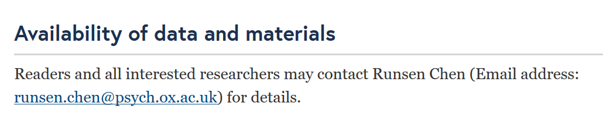
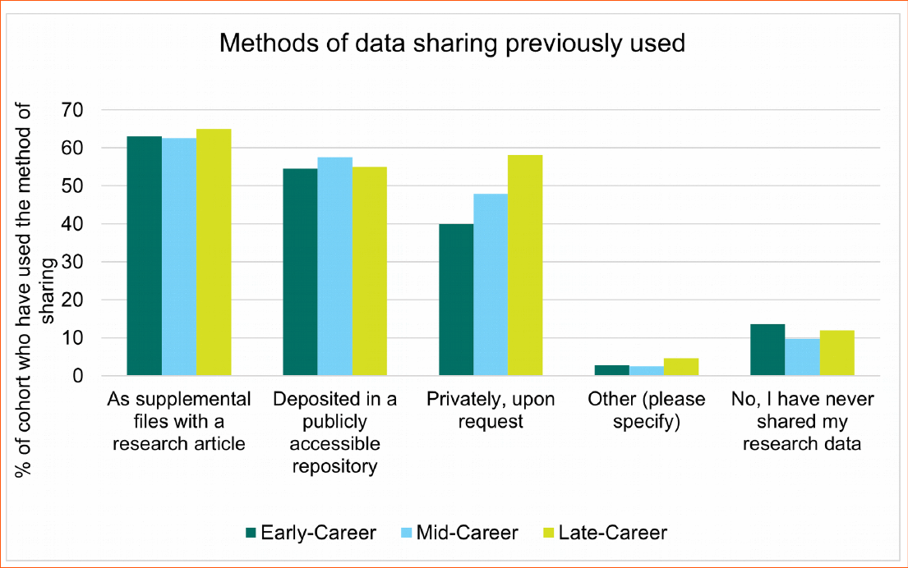
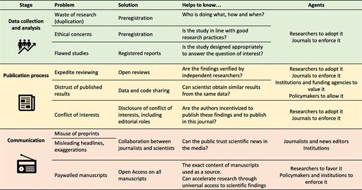
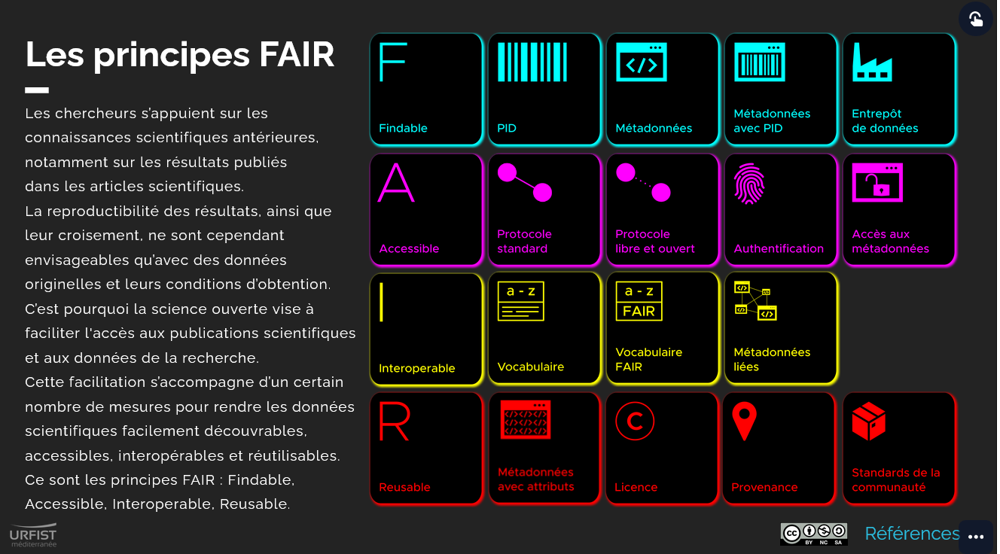
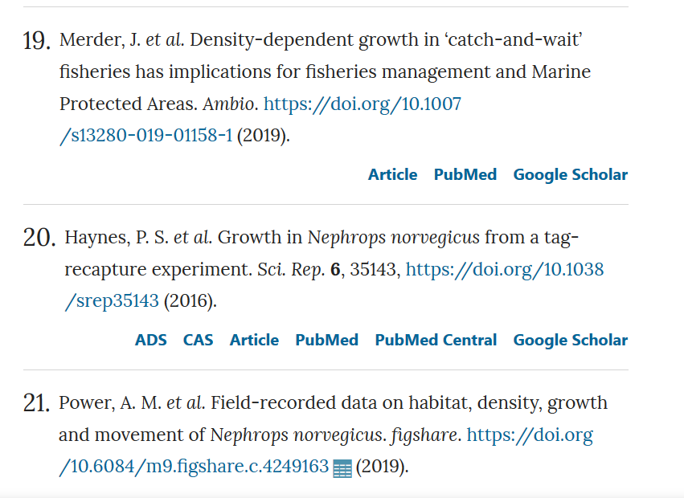
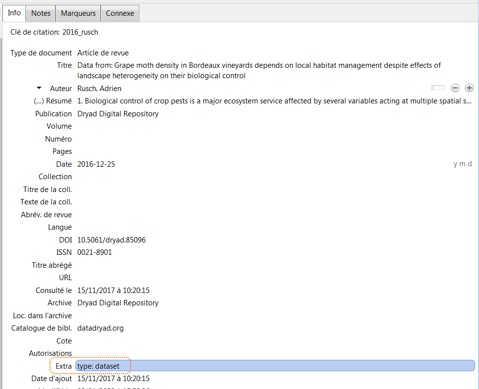

# _Data sharing_ : trouver, réutiliser et citer des données de recherche : COURS

## Sommaire

<!-- MDTOC maxdepth:1 firsth1:0 numbering:0 flatten:0 bullets:1 updateOnSave:1 -->

- [Sommaire](#sommaire)   
- [1. Introduction](#1-introduction)   
- [2. Trouver des données de recherche avec les outils bibliographiques](#2-trouver-des-données-de-recherche-avec-les-outils-bibliographiques)   
- [3. Trouver des données de recherche grâce aux entrepôts de données](#3-trouver-des-données-de-recherche-grâce-aux-entrepôts-de-données)   
- [4. Trouver des données de recherche pour les réutiliser](#4-trouver-des-données-de-recherche-pour-les-réutiliser)   
- [5. Citer des données de recherche](#5-citer-des-données-de-recherche)   
- [6. Politiques de données des éditeurs et des organismes de financement de la recherche](#6-politiques-de-données-des-éditeurs-et-des-organismes-de-financement-de-la-recherche)   
- [7. Conclusion](#7-conclusion)   

<!-- /MDTOC -->

## 0. Tour de table

* Dans quel laboratoire travaillez-vous?
* Quelles sont vos attentes pour le stage?

## 1. Introduction

### Définition et typologie des données de recherche

On devrait plutôt utiliser le pluriel pour les termes "définition" et "typologie", car plusieurs approches sont possibles.

L'OCDE donne ainsi une définition très large des données de recherche.

> Enregistrements factuels (chiffres, textes, images et sons), qui sont utilisés comme sources principales pour la recherche scientifique et sont généralement reconnus par la communauté scientifique comme nécessaires pour valider des résultats de recherche.

Source: Organisation de coopération et de développement économiques. (2007). Principes et lignes directrices de l’OCDE pour l’accès aux  données de la recherche financée sur fonds publics. Organisation de coopération et de développement économiques. https://doi.org/10.1787/9789264034020-en-fr

On trouve aussi des définitions plus restrictives, variables en fonction des domaines scientifiques, du contexte, etc.

Ainsi le NIH (National Institue of Health) fournit-il la définition suivante dans le cadre de ses appels à projet.

> “**Scientific Data**: The recorded factual material commonly accepted in the scientific community as of sufficient quality to validate and replicate research findings, regardless of whether the data are used to support scholarly publications. Scientific data do not include laboratory notebooks, preliminary analyses, completed case report forms, drafts of scientific papers, plans for future research, peer reviews, communications with colleagues, or physical objects, such as laboratory specimens.”

Source: National Institutes of Health. (2021). NOT-OD-21-013 : Final NIH Policy for Data Management and Sharing. https://grants.nih.gov/grants/guide/notice-files/NOT-OD-21-013.html

S'agissant des types de données, on retient les grandes catégories suivantes. A noter que le type de données peut aussi s'envisager du point de vue de l'achèvement.

* Données d'observation
* Données expérimentales
* Données de références
* Données de simulation numériques
* Données dérivées ou compilées

Fiche pratique d'1 page :

Bracco, L., Bouchet-Moneret, F., & Jouneau, T. (2021). Que sont les données de la recherche ? https://doi.org/10.5281/zenodo.5495210

### Modes de partage des données de recherche

Voici quelques exemples de différents modes de partage des données de recherche.

* Répondre manuellement à des demandes.

Afficher cet exemple en ligne : https://doi.org/10.1186/s12888-020-03010-3

* Annexer à un article des fichiers de _Supplementary data_, publiés sur le site de l’éditeur en même temps que l’article

* Déposer les données dans un entrepôt de données

Afficher cet exemple en ligne : https://doi.org/10.5255/UKDA-SN-852431

![question][quest]

Parmi les modes de partage des données ci-dessous, lequel vous semble-t-il le plus fréquent?

* Fichiers supplémentaires à un article scientifique
* Dépôt dans un entrepôt de données accessible publiquement
* Privé, sur demande
* Autre
* Aucun partage

![question][quest]

Quels avantages et quelles limites associez-vous à chacun d’entre eux?

***

![roue][roue]

Dans une enquête menée par l'éditeur PLOS, ce sont les **fichiers supplémentaires** qui sont les plus utilisés. Il convient toutefois de noter que les science humaines et sociales sont peu représentées dans les 1477 réponses reçues, qui se répartissent comme suit.

* 20,9% médecine et sciences de la santé
* 30,4% biologie et sciences de la vie
* 9,7% sciences sociales

> Sharing data as supplemental files alongside a research paper was the most common method for all career levels (67%), followed by deposition in a public repository (59%) and sharing privately on request (49%). Only 10% of respondents reported that they had never shared their research data – the largest proportion of whom (42%) work in Medicine and Health Science disciplines.

Source : Hrynaszkiewicz, I., Harney, J., & Cadwallader, L. (2021). A Survey of Researchers’ Needs and Priorities for Data Sharing. Data Science Journal, 20(1), 31. https://doi.org/10.5334/dsj-2021-031

Notez que ces modes de partage ne sont pas exclusifs les uns des autres, des fichiers supplémentaires à un article peuvent être déposés dans un entrepôt de données, parfois par  la revue elle-même.

Exemple :

Article : Rousselot, N., Tombrey, T., Zongo, D., Mouillet, E., Joseph, J.-P., Gay, B., & Salmi, L. R. (2018). Development and pilot testing of a tool to assess evidence-based practice skills among French general practitioners. BMC Medical Education, 18(1), 254. https://doi.org/10.1186/s12909-018-1368-y

Fichiers déposés dans Figshare : Rousselot, N., Tombrey, T., Drissa Zongo, Mouillet, E., Jean-Philippe Joseph, Gay, B., & Salmi, L. (2018). Development and pilot testing of a tool to assess evidence-based practice skills among French general practitioners [Data set]. In Figshare. https://doi.org/10.6084/M9.FIGSHARE.C.4297076.V1

### Enjeux

Les enjeux du partage des données sont multiples et variés, comme l'illustre la figure ci-dessous.

Source : Higman, R. (2017). Talking carrots and sticks for RDM at the #datastewards networking day, sharing the graphic on reasons to share we use in @UoMRDMService trainingpic.twitter.com/bMsj6h57RG [Tweet]. @RosieHLib. https://twitter.com/RosieHLib/status/936587668607160320

![question][quest]

Par lesquels de ces enjeux vous sentez-vous concerné actuellement, compte tenu de votre sujet de recherche, du degré d'avancement de votre thèse, etc.?

Ces enjeux s'entendent également du point de vue du processus de publication.

Source : Besançon, L., Peiffer-Smadja, N., Segalas, C., Jiang, H., Masuzzo, P., Smout, C., Billy, E., Deforet, M., & Leyrat, C. (2021). Open science saves lives : Lessons from the COVID-19 pandemic. BMC Medical Research Methodology, 21(1), 117. https://doi.org/10.1186/s12874-021-01304-y

Fiche pratique en 1 page :

Bracco, L., Bouchet-Moneret, F., & Jouneau, T. (2021). Pourquoi ouvrir ses données ? https://doi.org/10.5281/zenodo.5495217

## 2. Trouver des données de recherche avec les outils bibliographiques

On peut distinguer au moins 3 méthodes pour trouver des données de recherche. Dans cette partie nous abordons les 2 premières, la troisième fait l'objet de la partie suivante.

* Méthode 1 : utiliser les fonctionnalités intégrées aux **bases de données bibliographiques**, par exemple Scopus et PubMed.
* Méthode 2 : interroger les **outils de recherche spécialisés** qu'il s'agisse de moteurs de recherche comme DataCite Search ou d'index de base de données (Data Index du Web of Science).
* Méthode 3 : utiliser les **entrepôts de données**, **généralistes**  (tels que Zenodo, Dryad ou Figshare) ou **spécialisés**.

### Méthode 1, fonctionnalités intégrées aux bases bibliographiques

En plus du _data availability statement_ (parfois non accessible sans abonnement à la revue), des outils intégrés aux bases de données bibliographiques permettent d'identifier les jeux de données **liés à des publications**.

Dans la nouvelle interface de **[PubMed](https://www.ncbi.nlm.nih.gov/pubmed/?otool=ifruvsblib)**, il s'agit de l'attribut _Associated data_, disponible sous la forme d'un filtre à partir d'une liste de résultats. Cet attribut filtre sur la présence dans l'article d'un lien vers une source de données comme ClinicalTrials.gov, GenBank, Figshare ou Dryad.

Dans **[Scopus](http://docelec.u-bordeaux.fr/login?url=http://www.scopus.com)**, il s'agit de l'encart _Related Research Data_, accessible depuis la notice d'un article en particulier. Cette fonctionnalité est donc très limitée, puisqu'elle ne permet pas de sélectionner un ensemble d'articles ayant des données associées.

Le **type de publication** peut également être exploité comme critère de recherche ou de filtre. Il permet en effet d'identifier les articles de données, ou _data papers_. Les valeurs associées diffèrent en fonction des bases de données.

* Scopus -> choisir la valeur _data paper_
* PubMed -> choisir la valeur _dataset_

###  Méthode 2, les outils de recherche spécialisés

Certains des services suivants indexent uniquement des données de recherche, d'autres non.

![roue][roue]

#### DataCite Search

URL : https://search.datacite.org

Fournisseur du service : l'organisation à but non lucratif DataCite - ses membres sont des organismes de recherche, des universités, des sociétés savantes, des fournisseurs de service, etc.

##### Couverture

DataCite Search permet de chercher parmi tous les objets auxquels un DOI a été attribué par DataCite. La couverture excède celle des données de recherche, car DataCite fournit à des organismes de recherche des DOI pour toutes leurs productions, qu'il s'agisse de données de recherche ou de thèses, de preprints, etc.

[Consulter la liste des entrepôts de données interrogeables par DataCite Search](https://search.datacite.org/repositories)

##### Autres caractéristiques

* Seule une recherche simple est possible.
* Les filtres disponibles sont limités à l'année d'enregistrement, au type de ressource et à l'affiliation.
* Depuis janvier 2020, DataCite Search affiche les liens (de citation, de référence, de relation) entre les objets.

![roue][roue]

#### Mendeley data search

URL : https://data.mendeley.com/research-data

Fournisseur du service : l'éditeur commercial Elsevier

##### Couverture

Le service de recherche de Mendeley Data interroge d'autres sources en plus de Mendeley Data.

Deux types de source sont distingués.
* _Data repositories_ : entrepôts hébergeant uniquement des données
* _Article repositories_ : on peut à nouveau distinguer plusieurs cas de figure.
  * Archives ouvertes institutionnelles hébergeant à la fois des publications et des données (University of British Columbia par exemple)
  * Serveur de preprints arXiv -> on trouve à la fois les figures et les tableaux insérés dans les articles et les fichiers de données supplémentaires
  * Plateforme ScienceDirect de l'éditeur Elsevier -> on trouve à la fois les figures et les tableaux insérés dans les articles et les fichiers de données supplémentaires

##### Autres caractéristiques

La syntaxe de recherche permet de construire des recherches avancées, elle est détaillée dans la [FAQ Mendeley Data > Data Search](https://data.mendeley.com/faq#data-search).

Exemple : liste de résultats pour la recherche sur le champ "Institution" contient "Bordeaux" :

<https://data.mendeley.com/research-data/?search=INSTITUTION(Bordeaux)>

![roue][roue]

#### Google dataset search

URL : https://datasetsearch.research.google.com/

Fournisseur du service : la société commerciale Google

##### Couverture

La couverture est limitée aux données, mais non aux données de recherche ; elle est indéfinie et potentiellement illimitée.

>One thing hasn't changed however: anybody who publishes data can make their datasets discoverable in Dataset Search by using an open standard (schema.org) to describe the properties of their dataset on their own web page.

Noy, N. (2020, janvier 23). _Discovering millions of datasets on the web_. Google Blog. https://blog.google/products/search/discovering-millions-datasets-web/

##### Autres caractéristiques

Comme pour Google Scholar, les fonctionnalités de recherche sont très limitées.

 * La syntaxe de recherche n'est pas définie.
 * Les filtres sont peu nombreux.
 * Lorsque le nombre de résultats excède 100, la même mention demeure affichée : "Plus de 100 ensembles de données trouvés".

La localisation est affichée sous la forme d'une carte lorsque des informations de géolocalisation sont associées aux données.

![roue][roue]

#### Dimensions

URL : https://www.dimensions.ai/

Fournisseur du service : la société commerciale Digital Science (propriétaire de Figshare, Altmetric, ReadCube, etc.)

##### Couverture

La couverture de Dimensions excède les données de recherche, puisque 6 types de contenu sont indexés  :  _publications_, _datasets_, _grants_, _patents_, _clinical trials_, _policy documents_.

Pour les données de recherche, seuls les objets de type _dataset_ dans les sources sont indexés, ce qui exclut par exemple les vidéos, images, logiciels, etc. Les sources sont à la fois des entrepôts de données (Dryad, Pangaea, etc.) et des sites d'éditeurs, lorsque l'éditeur identifie par un DOI les **fichiers de données supplémentaires des articles**.

La restriction affichée aux seuls "jeux de données" n'est de fait pas entièrement exacte, car :

* les fichiers de données supplémentaires sont indexés à l'unité ;
* le type _dataset_ n'est pas appliqué uniformément par tous les entrepôts de données. Certains peuvent l'utiliser pour des fichiers de données unitaires non organisés en un jeu de données - exemple :

Sordello, R., Flamerie, F., Livoreil, B., & Vanpeene, S. (2019). MOESM4 of Evidence of the environmental impact of noise pollution on biodiversity : A systematic map protocol [Data set]. In _Figshare_. https://doi.org/10.6084/m9.figshare.7711562.v1

**NB** d'autres fichiers supplémentaires à cet article, auxquels le type _document_ a été assigné par Figshare, ne sont pas indexés par Dimensions, mais peuvent l'être par d'autres services précédemment mentionnés (Mendeley data search par exemple).

##### Autres caractéristiques

Un filtre _Fields of research_ est disponible.

Notez que le filtre par institution n'est pas disponible dans la version gratuite ; la version gratuite permet par ailleurs d'interroger seulement 2 des 6 types de contenu : _publications_ et _datasets_.

![roue][roue]

#### Autres services

D'autres services indexent des données et peuvent être utiles pour identifier des données existantes ; la liste suivante n'est pas exhaustive.

* [Web of Science Data Index](https://clarivate.com/webofsciencegroup/solutions/webofscience-data-citation-index/) : sur abonnement - l'université de Bordeaux n'est pas abonnée à cette ressource.
* [B2FIND](http://b2find.eudat.eu/) : composante de l'infrastructure européenne EUDAT ; l'interface permet notamment d'effectuer des recherches par couverture chronologique et géographique.
* [Isidore](https://isidore.science/) : spécialisé pour les sciences humaines et sociales, le moteur de recherche d'HumaNum permet de formuler des recherches ciblées sur les données, notamment grâce au critère "Par type de document" > "Données d'enquêtes", "Autres", etc.
* [Bielefeld academic search engine](https://www.de.base-search.net/) : le moteur de recherche de l'université de Bielefeld  permet de cibler des recherches sur les données, notamment grâce au critère "Type de document" > "Dataset", "Unknown", etc.

### TP1, trouver des données avec les bases de données bibliographiques et les moteurs de recherche spécialisés

![exe][exe]

✒️ Voir [Fiche TP](https://github.com/fflamerie/ED_datasharing/blob/master/content/ED_datasharing_TP.md)

🕰️ Rendez-vous dans **10 minutes** pour une mise en commun.

## 3. Trouver des données de recherche grâce aux entrepôts de données

Cette méthode rejoint les astuces 2, 4 et 8 des 11 astuces recensées ci-dessous.

Gregory, K., Khalsa, S. J., Michener, W. K., Psomopoulos, F. E., Waard, A. de, & Wu, M. (2018). Eleven quick tips for finding research data. PLOS Computational Biology, 14(4), e1006038. https://doi.org/10.1371/journal.pcbi.1006038

> Tip 1: Think about the data you need and why you need them.
>
> Tip 2: Select the most appropriate resource.
>
> Tip 3: Construct your query strategically.
>
> Tip 4: Make the repository work for you.
>
> Tip 5: Refine your search.
>
> Tip 6: Assess data relevance and fitness -for -use.
>
> Tip 7: Save your search and data- source details.
>
> Tip 8: Look for data services, not just data.
>
> Tip 9: Monitor the latest data.
>
> Tip 10: Treat sensitive data responsibly.
>
> Tip 11: Give back (cite and share data).

[lire l'astuce 2 sur le site de PLOS](https://journals.plos.org/ploscompbiol/article?id=10.1371/journal.pcbi.1006038#sec003)

[lire l'astuce 4 sur le site de PLOS](https://journals.plos.org/ploscompbiol/article?id=10.1371/journal.pcbi.1006038#sec005)

[lire l'astuce 8 sur le site de PLOS](https://journals.plos.org/ploscompbiol/article?id=10.1371/journal.pcbi.1006038#sec009)

Interroger directement un entrepôt de données peut notamment permettre de bénéficier de fonctionnalités de recherche spécifiques.

👉 Cela implique au préalable d'identifier les entrepôts de données appropriés.

### Entrepôts de données généralistes et spécialisés

Voici quelques exemples de jeux de données déposées dans des entrepôts de données généralistes et spécialisés.

Quelles différences observez-vous entre eux?

#### Exemple 1, agronomie et sciences sociales

**Dépôt dans [CIRAD Dataverse](https://dataverse.cirad.fr)**

Fok, M. (2021). Crédits formel et informel de trésorerie aux producteurs de coton au Bénin [Data set]. In CIRAD Dataverse. https://doi.org/10.18167/DVN1/NCNHJZ

#### Exemple 2, archéologie

**Dépôt dans [Zenodo](https://zenodo.org)**

Lebrun, B., & Tribolo, C. (2020). Optically Stimulated Luminescence data from archaeological site Uzès (Gard, France) [Data set]. In Zenodo. https://doi.org/10.5281/zenodo.4061220

#### Exemple 3, psychologie

**Dépôt dans [UK Data Archive ReShare](https://reshare.ukdataservice.ac.uk)**

Biggart, L. P. (2016). Emotional intelligence in social work [Data set]. In UK Data Service. https://doi.org/10.5255/UKDA-SN-852431

#### Exemple 4, écologie

**Dépôt dans [ACEAS Data Portal](http://aceas.tern.org.au/knb/) (ACEAS = Australian Centre for Ecological Analysis and Synthesis)**

Haberle, S., Hopf, F., Tng, D., Johnston, F., & Bowman, D. (2014). Weekly pollen count data for for the University of Tasmania, Hobart. [Data set]. In ACEAS. https://doi.org/10.4227/05/5344E9A41A124

#### Exemple 5, code informatique

**Dépôt dans [Zenodo](https://zenodo.org)**

Althaus, C. (2018). Analyses of Ebola virus disease outbreaks [Data set]. In Zenodo. https://doi.org/10.5281/zenodo.1285677

### Identifier un entrepôt de données spécialisé pertinent

La démarche pour identifier un entrepôt de données approprié pour **déposer** des données est détaillée dans le support de formation [Zenodo, Figshare, etc.: rechercher et partager des données de recherche grâce aux entrepôts de données](https://github.com/fflamerie/atBU_entrepots_donnees).

Pour un aperçu concernant les entrepôts de données **généralistes**, vous pouvez tester notre outil en ligne d'aide à la décision [Trouver un entrepôt de données](http://busec2.u-bordeaux.fr/aide-choix-entrepot).

On se focalise ici sur la recherche d'un entrepôt de données dans la perspective de trouver des données existantes et non d'en déposer.
Aussi nous nous concentrons sur la recherche d'entrepôts **spécialisés**, pouvant offrir des fonctionnalités de recherche spécifiques, ou dont la couverture spécialisée permet de limiter le bruit. Parmi les outils mentionnés dans le support de formation précédemment cité, nous retenons l'annuaire [re3data](https://www.re3data.org/).

### Trouver un entrepôt de données avec re3data

Registry of Research Data Repositories. https://doi.org/10.17616/R3D // citation simplifiée : re3data - https://www.re3data.org/

Il s'agit de la ressource de référence, indexant plus de 2000 entrepôts.

On peut naviguer dans re3data par :
* [sujet](https://www.re3data.org/browse/by-subject/),
* [type de contenu](https://www.re3data.org/browse/by-content-type/),
* [pays](https://www.re3data.org/browse/by-country/).

👉  [Afficher la liste complète des entrepôts référencés dans re3data](https://www.re3data.org/search?query=)

De nombreux filtres permettent ensuite d'affiner les listes de résultats, en fonction par exemple des critères suivants.

* **Certificates** : par quelle certification l'entrepôt est-il qualifié?
* **Accès** : plusieurs valeurs de fermé à ouvert - se décompose en 3 types d'accès :
  *  **Database access** : accès à l'entrepôt de données lui-même : sous quelles conditions un utilisateur peut-il accéder à la base de données en général?
  * **Data access** : accès aux jeux de données déposés dans un entrepôt de données spécifique : sous quelles conditions un utilisateur peut-il accéder à un jeu de données?
  * **Data upload** : accès à la soumission de données : sous quelles conditions un utilisateur peut-il soumettre des données ?
* **Versioning** : les jeux de données peuvent-ils être versionnés?

### TP2, trouver un entrepôt de données spécialisé avec re3data

![exe][exe]

✒️ Voir [Fiche TP](https://github.com/fflamerie/ED_datasharing/blob/master/content/ED_datasharing_TP.md)

🕰️ Rendez-vous dans **15 minutes** pour une mise en commun.

## 4. Trouver des données de recherche pour les réutiliser

Nous allons aborder ici les astuces 1 et 6 de l'article "Eleven quick tips..." précédemment cité.

> Tip 1: Think about the data you need and why you need them.
>
> Tip 6: Assess data relevance and fitness -for -use.

[lire l'astuce 1 sur le site de PLOS](https://journals.plos.org/ploscompbiol/article?id=10.1371/journal.pcbi.1006038#sec002)

[lire l'astuce 6 sur le site de PLOS](https://journals.plos.org/ploscompbiol/article?id=10.1371/journal.pcbi.1006038#sec007)

### TP3, trouver et évaluer un jeu de données

![exe][exe]

✒️ Voir [Fiche TP](https://github.com/fflamerie/ED_datasharing/blob/master/content/ED_datasharing_TP.md)

🕰️ Rendez-vous dans **20 minutes** pour une mise en commun.

### Focus sur les principes FAIR

Bezjak, S., Clyburne-Sherin, A., Conzett, P., Fernandes, P. L., Görögh, E., Helbig, K., Kramer, B., Labastida, I., Niemeyer, K., Psomopoulos, F., Ross-Hellauer, T., Schneider, R., Tennant, J., Verbakel, E., Brinken, H., & Heller, L. (2018). Open Science Training Handbook. FOSTER Plus Consortium. https://book.fosteropenscience.eu/

Les principes FAIR visent à assurer que les donnnées sont partagées d'une manière qui permette et améliore leur réutilisation, à la fois par des humains et par des machines. A chaque principe sont associées des caractéristiques qui en précisent et spécifient l'application.

Les principes FAIR ont été développés initialement au sein [du groupement FORCE11](https://www.force11.org/about), the Future of Research Communication and e-Scholarship, et présentés dans un article paru en 2016 dans _Scientific Data_.

> To be Findable:
>
> F1. (meta)data are assigned a globally unique and persistent identifier
>
> F2. data are described with rich metadata (defined by R1 below)
>
> F3. metadata clearly and explicitly include the identifier of the data it describes
>
> F4. (meta)data are registered or indexed in a searchable resource
>
> To be Accessible:
>
> A1. (meta)data are retrievable by their identifier using a standardized communications protocol
>
> A1.1 the protocol is open, free, and universally implementable
>
> A1.2 the protocol allows for an authentication and authorization procedure, where necessary
>
> A2. metadata are accessible, even when the data are no longer available
>
>To be Interoperable:
>
>I1. (meta)data use a formal, accessible, shared, and broadly applicable language for knowledge representation.
>
>I2. (meta)data use vocabularies that follow FAIR principles
>
> I3. (meta)data include qualified references to other (meta)data
>
>To be Reusable:
>
>R1. meta(data) are richly described with a plurality of accurate and relevant attributes
>
>R1.1. (meta)data are released with a clear and accessible data usage license
>
>R1.2. (meta)data are associated with detailed provenance
>
>R1.3. (meta)data meet domain-relevant community standards

Source : Wilkinson, M. D., Dumontier, M., Aalbersberg, Ij. J., Appleton, G., Axton, M., Baak, A., Blomberg, N., Boiten, J.-W., Santos, L. B. da S., Bourne, P. E., Bouwman, J., Brookes, A. J., Clark, T., Crosas, M., Dillo, I., Dumon, O., Edmunds, S., Evelo, C. T., Finkers, R., … Mons, B. (2016). The FAIR Guiding Principles for scientific data management and stewardship. Scientific Data, 3, sdata201618. https://doi.org/10.1038/sdata.2016.18

#### Comprendre et appliquer les principes FAIR

L'infographie interactive ci-dessous vous permet d'explorer chacun des principes FAIR.

Urfist Méditerranée. (2019). Les principes FAIR [DoRANum]. https://doi.org/10.13143/z7s6-ed26

_Apercçu statique de l'infographie FAIR_

Le site de l’INRAE consacre des pages détaillées et en français aux principes FAIR, y compris des recommandations et des questions à se poser lors de la rédaction d'un plan de gestion de données. Ces pages sont accessibles à partir de la page suivante.

IST-Données de la Recherche. (2018, août). Produire des données FAIR. Datapartage. https://datapartage.inrae.fr/Produire-des-donnees-FAIR

Le Fonds national suisse de la recherche scientifique propose sous la forme d'un tableau récapitulatif une analyse pratique en 3 rubriques : _In other words_, _Researcher’s responsibility_, _Requirements to be fulfilled by the repository_.

Fonds national suisse de la recherche scientifique. (2017). Explanation of the FAIR data principles. http://www.snf.ch/SiteCollectionDocuments/FAIR_principles_translation_SNSF_logo.pdf

#### Données FAIR et ouvertes?

L’application des principes FAIR aux données implique  que ces dernières doivent pouvoir être trouvées, comprises et réutilisées. Cela ne signifie pas qu’elles doivent être nécessairement en accès entièrement libre.

Ainsi des données peuvent être **FAIR mais non ouvertes**, si elles appliquent les principes FAIR, mais sont soumises à des restrictions d’accès.

Des données peuvent être **ouvertes mais non FAIR**, si elles sont mises à disposition publiquement, mais sont dépourvues d’une documentation suffisante ou d’une licence précisant clairement les conditions de réutilisation.

## 5. Citer des données de recherche

Cela correspond à une partie de l'astuce 11 de l'article "Eleven quick tips..." cité précédemment.

> Tip 11: Give back (cite and share data).

[lire l'astuce 11 sur le site de PLOS](https://journals.plos.org/ploscompbiol/article?id=10.1371/journal.pcbi.1006038#sec007)

### Citation en bibliographie

De plus en plus d'éditeurs incitent les auteurs à citer les jeux de données au même titre que les articles dans leur bibliographie, dans une rubrique dédiée ou dans la bibliographie principale.

_Scientific Data_ requiert ainsi que les données soient citées dans la biliographie principale des articles ; la politique de citation des données de cettet revue est détaillée dans l'éditorial suivant de 2019.

Data citation needed. (2019). Scientific Data, 6(1), 27. https://doi.org/10.1038/s41597-019-0026-5

Exemple de données citées dans la bibliographie principale, référence n° 21 :

Power, A. M., Merder, J., Browne, P., Freund, J. A., Fullbrook, L., Graham, C., Kennedy, R. J., O’Carroll, J. P. J., Wieczorek, A. M., & Johnson, M. P. (2019). Field-recorded data on habitat, density, growth and movement of Nephrops norvegicus. Scientific Data, 6(1), 7. https://doi.org/10.1038/s41597-019-0013-x

#### Comment citer un jeu de données?

##### Avec un logiciel de gestion bibliographique, Zotero

 * Enregistrer les jeux de données sous le type de document "Article de revue"
 * Spécifier : `type: dataset` dans le champ `Extra`

 * Choisir un style bibliographique qui prend en charge le type de document "Dataset", par exemple [APA](http://owl.english.purdue.edu/owl/resource/560/01/) ou Vancouver

##### Avec l'outil Citation Formatter fourni par DataCite

Ce service en ligne est accessible à l'adresse : https://citation.crosscite.org/

A partir d'un DOI, puis du choix d'un style bibliographique et de la langue, il génère automatiquement une citation correctement mise en forme.

### Data availability statement

La bibliographie ou la liste des références citées n'est pas la seule rubrique d'un article dans laquelle des données de recherche peuvent ou doivent être mentionnées.

Le _data availability statement_ ou _data access statement_ décrit où les données sous-jacentes à l'article peuvent être trouvées, et sous quelles conditions elles sont accessibles.

L'université de Manchester propose plusieurs exemples de formulation pour prendre en compte les cas suivants :

* données en accès ouvert,
* analyse secondaire de données existantes,
* contraintes éthiques,
* contraintes commerciales,
* contraintes de coût,
* données originales dans un format propriétaire,
* données non numériques,
* absence de création de données nouvelles,
* données disponibles de façon ouverte.

The University of Manchester Library. Data access statements. https://www.library.manchester.ac.uk/using-the-library/staff/research/research-data-management/sharing/data-access-statements/

Voir aussi les exemples par discipline mis à disposition par l'université de Bristol.

University of Bristol. Sharing research data. http://www.bristol.ac.uk/staff/researchers/data/sharing-research-data/

L'ordre et la nature des informations à mentionner peuvent varier en fonction des éditeurs, voir par exemple les recommandations de Springer Nature, incluant des liens vers des exemples dans des articles publiés.

Springer Nature. Data availability statements. http://www.springernature.com/gp/authors/research-data-policy/data-availability-statements/12330880

## 6. Politiques de données des éditeurs et des organismes de financement de la recherche

![brain][brain]

Nous l'avons mentionné plus haut de façon éparse, de plus en plus d'éditeurs scientifiques et d'organismes de financement de la recherche adoptent des politiques de données, le partage des données étant l'une des composantes de politiques couvrant un spectre plus large d'actions et de recommandations.

### Editeurs

PLOS a été l'un des premiers éditeurs à définir une politique de données en 2014, obligeant notamment au dépôt en accès ouvert des données sous-jacentes aux articles.

L'**accès aux données sous-jacentes** aux articles et la **citation des données** constituent les deux points les plus évidents concernant le partage des données.

Une politique de données et plus largement  s'entend toutefois plus largement et peut recouvrir bien plus d'aspects, comme le montre le tableau ci-dessous, qui représentent 14 caractéristiques, réparties en 6 niveaux de politique.

Source : Hrynaszkiewicz, I., Simons, N., Hussain, A., Grant, R., & Goudie, S. (2020). Developing a Research Data Policy Framework for All Journals and Publishers. Data Science Journal, 19(1), 5. https://doi.org/10.5334/dsj-2020-005

Si on considère plus largement le processus de publication, les données ne sont elles-mêmes qu'une constituante d'une démarche globale d'ouverture et de transparence. L'initiative **Transparency and Openness Promotion (TOP)** s'inscrit dans cette perspective, comme l'illustre le tableau synthétique des critères pris en compte et leur degré d'application.

[Afficher le tableau sur le site TOP](https://osf.io/2cz65/)

Notez que cette démarche n'est pas propre à un domaine disciplinaire. Les 16 revues recensées par TOP comme atteignant le degré 3 relèvent ainsi de domaines différents.

Voir [la rubrique "Data Reproducibility Policies" sur le site de TOP](https://osf.io/kgnva/wiki/home/#Data_Reproducibility_Policies_12) :

> The following **16** journals use shared data and code to reproduce the computational findings reported in articles prior to publication. **This represents level 3 of the TOP Guidelines for Data, Materials, and Code.**
>
> - The nine journals of the [American Economic Association][5]
>    - Author instructions and guidance available [here][6]  
> - [American Journal of Political Science][7]
> - [Biostatistics][8]
> - [Journal of Experimental Political Science][9]
> - [Journal of Peace Research][10]
> - [Meta-Psychology][11]
> - [Organic Syntheses][12]
> - [Quarterly Journal of Political Science][13]

[5]: https://www.aeaweb.org/journals/data
[6]: https://aeadataeditor.github.io/aea-de-guidance/
[7]: https://ajps.org/ajps-replication-policy/
[8]: https://academic.oup.com/biostatistics/pages/General_Instructions
[9]: https://www.cambridge.org/core/journals/journal-of-experimental-political-science/information/instructions-contributors
[10]: https://www.prio.org/JPR/Datasets/
[11]: https://open.lnu.se/index.php/metapsychology/about
[12]: http://www.orgsyn.org/instructions.aspx
[13]: http://www.nowpublishers.com/Journal/AuthorInstructions/QJPS

TOP attribue un **"TOP factor"**  aux revues, en se fondant sur le tableau présenté ci-dessus. En 2021, plus de 900 revues ont reçu un "TOP factor".

![question][quest]

 * Retrouvez-vous un titre que vous connaissez dans la liste des revues éavluées?
 * Son score vous surprend-il? Pourquoi?

[Liste des revues ayant un TOP factor](https://osf.io/qatkz/)

[Présentation du TOP factor 2021 sur le site de TOP](https://osf.io/jn3we/)

### Organismes de financement

Deux aspects constituent des éléments centraux dans la politique des organismes de financement.

* La recherche de la conformité aux **principes FAIR**  ; l'approche _"as open as possible, as close as necessary"_ de l'Union européenne est ainsi reprise par l'ANR.
* La mise en oeuvre de bonnes pratiques de gestion des données, décrites dans un **plan de gestion de données** (DMP - data management plan).

Pour une présentation générale de la politique de science ouverte de l'Union européenne, voir le livret ci-dessous, duquel est extrait la figure concernant les impacts et résultats attendus.

Union européenne. (2021). Horizon Europe, science ouverte : Partage précoce des connaissances et des données,  et collaboration ouverte. Office des publications de l’Union européenne. https://doi.org/10.2777/838069

Les obligations et recommandations concernant la gestion des données de recherche sont détaillées à la diapositive 8 de la présentation suivante.

López de San Román, A. (2021, avril 12). Open Science in Horizon Europe. LERU CE7 Seminar. https://doi.org/10.5281/zenodo.4681073

La politique de science ouverte de **l'ANR** est détaillée sur [la page "La science ouverte" de son site internet](https://anr.fr/fr/lanr-et-la-recherche/engagements-et-valeurs/la-science-ouverte/) .

## 7. Conclusion

Reprenons la conclusion de l'article

Gregory, K., Khalsa, S. J., Michener, W. K., Psomopoulos, F. E., Waard, A. de, & Wu, M. (2018). Eleven quick tips for finding research data. _PLOS Computational Biology_, _14_(4), e1006038. https://doi.org/10.1371/journal.pcbi.1006038

> Regardless of whether you are acting as a data seeker or a data creator, remember that ‘data discovery and reuse are most easily accomplished when: (1) data are logically and clearly organized; (2) data quality is assured; (3) data are preserved and discoverable via an open data repository; (4) data are accompanied by comprehensive metadata; (5) algorithms and code used to create data products are readily available; (6) data products can be uniquely identified and associated with specific data originator(s); and (7) the data originator(s) or data repository have provided recommendations for citation of the data product(s)’

[fleche]: img/foster_icone_arrow.png
[roue]: img/foster_icone_gears.png
[quest]: img/foster_icone_questions.png
[exe]: img/foster_icone_exercises.png
[brain]: img/foster_icone_brain.png

# Crédits

 Ce document est mis à disposition selon les termes de la <a rel="license" href="http://creativecommons.org/licenses/by-sa/3.0/fr/">Licence Creative Commons Attribution -  Partage dans les Mêmes Conditions 3.0 France</a>.

**Auteur**

Frédérique Flamerie

 [orcid.org/0000-0001-6014-0134](https://orcid.org/0000-0001-6014-0134)

**Icônes**

Bezjak, S., Clyburne-Sherin, A., Conzett, P., Fernandes, P. L., Görögh, E., Helbig, K., Kramer, B., Labastida, I., Niemeyer, K., Psomopoulos, F., Ross-Hellauer, T., Schneider, R., Tennant, J., Verbakel, E., Brinken, H., & Heller, L. (2018). _Open Science Training Handbook_. FOSTER Plus Consortium. https://book.fosteropenscience.eu/
 [CC-Zero]
