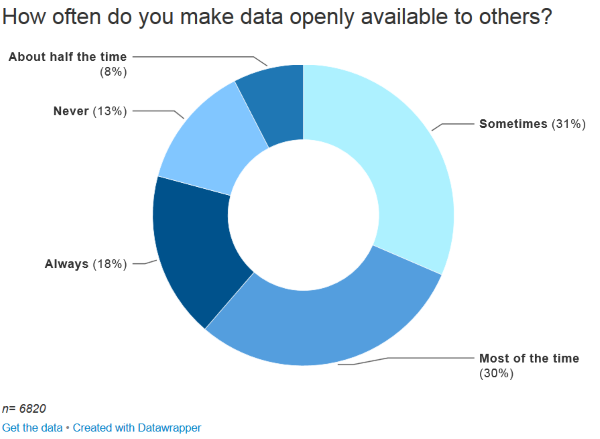
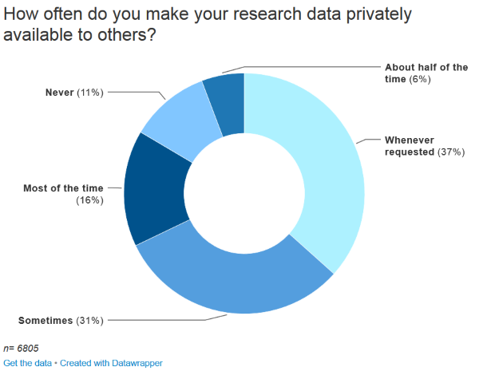
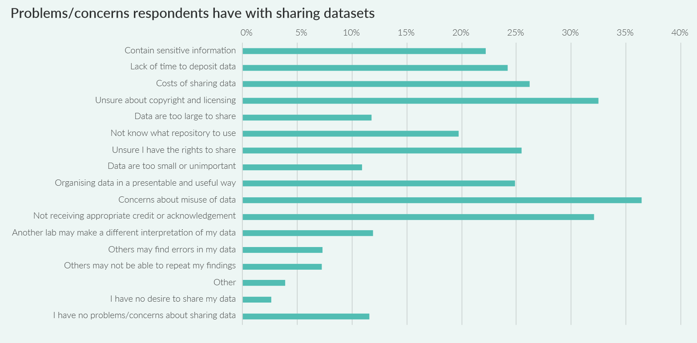
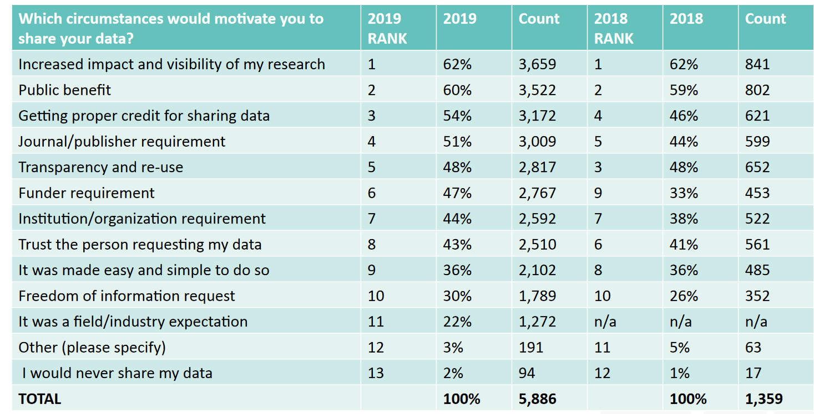
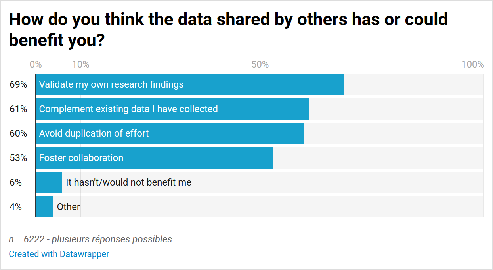

# _Data sharing_ : trouver, réutiliser et citer des données de recherche - TP et corrigé des quizz

Pour toutes les questions des quizz, la source est l'enquête menée pour l'édition 2019 du rapport _State of Open Data_. Cette enquête a reçu 9500 réponses de chercheurs du monde entier.

Digital Science, Fane, B., Ayris, P., Hahnel, M., Hrynaszkiewicz, I., Baynes, G., & Farrell, E. (2019). _The State of Open Data Report 2019_. Digital Science. https://doi.org/10.6084/m9.figshare.9980783.v2

Nature Research, Penny, D., Fane, B., Goodey, G., & Baynes, G. (2019). State of Open Data 2019 [Data set]. In _Figshare_. https://doi.org/10.6084/m9.figshare.10011788.v2

## Sommaire

_Les liens ne sont pas cliquables dans le fichier PDF._

<!-- MDTOC maxdepth:3 firsth1:0 numbering:0 flatten:0 bullets:1 updateOnSave:1 -->

- [Sommaire](#sommaire)   
- [Quizz 1, enjeux du partage des données de recherche](#quizz-1-enjeux-du-partage-des-données-de-recherche)   
   - [A votre avis, à quelle fréquence les chercheurs mettent-ils à disposition des autres leurs données de façon ouverte?](#a-votre-avis-à-quelle-fréquence-les-chercheurs-mettent-ils-à-disposition-des-autres-leurs-données-de-façon-ouverte)   
   - [Quels sont ou quels seraient vos problèmes et préoccupations concernant le partage de vos données ?](#quels-sont-ou-quels-seraient-vos-problèmes-et-préoccupations-concernant-le-partage-de-vos-données)   
   - [Quelles circonstances vous inciteraient-elles à partager vos données ?](#quelles-circonstances-vous-inciteraient-elles-à-partager-vos-données)   
- [Quizz 2, réutiliser des données](#quizz-2-réutiliser-des-données)   
   - [A votre avis, quelle part des chercheurs ont-ils déjà réutilisé des données ouvertes?](#a-votre-avis-quelle-part-des-chercheurs-ont-ils-déjà-réutilisé-des-données-ouvertes)   
   - [De quelle manière pensez-vous que les données partagées par d'autres vous ont été ou pourraient vous être utiles ?](#de-quelle-manière-pensez-vous-que-les-données-partagées-par-dautres-vous-ont-été-ou-pourraient-vous-être-utiles)   
- [TP1, trouver des entrepôts de données](#tp1-trouver-des-entrepôts-de-données)   
- [TP2, trouver et évaluer un jeu de données](#tp2-trouver-et-évaluer-un-jeu-de-données)   
   - [Recherche de données](#recherche-de-données)   
   - [Evaluation des données trouvées](#evaluation-des-données-trouvées)   

<!-- /MDTOC -->

## Quizz 1, enjeux du partage des données de recherche

### A votre avis, à quelle fréquence les chercheurs mettent-ils à disposition des autres leurs données de façon ouverte?

_Une seule réponse possible_

* Toujours
* La plupart du temps
* Environ la moitié du temps
* Parfois
* Jamais

_How often do you make data openly available to others?_

_n = 6820_ - _réponses triées par fréquence_

| Fréquence | Nombre de réponses | % des réponses |
|:-- | --:| --:|
|Parfois - _Sometimes_ | 2147  | **31** |
|La plupart du temps - _Most of the time_ | 2036  | **30** |
|Toujours - _Always_ | 1217  | 18 |
|Jamais - _Never_  | 904  | 13 |
|Environ la moitié du temps - _About half the time_ | 516  | 8 |

L'enquête comportait également une question concernant la mise à disposition **dans un cadre privé**.

_How often do you make your research data privately available to others?_

_n = 6805_

_réponses triées par fréquence_

| Fréquence| Nombre de réponses | % des réponses |
|:-- | --:| --:|
|Whenever requested  | 2493 | **37** |
|Sometimes  | 2126 | 31 |
|Most of the time | 1064 | 16 |
|Never | 731 | **11**  |
|About half of the time  | 391 | 6  |

### Quels sont ou quels seraient vos problèmes et préoccupations concernant le partage de vos données ?

_Plusieurs réponses possibles_

* D'autres pourraient trouver des erreurs dans mes données
* Préoccupations concernant un usage impropre des données
* Manque de temps pour déposer les données
* Ne pas recevoir le crédit ou la reconnaissance appropriés
* Je n'ai pas envie de partager mes données
* Autre (veuillez préciser)

_What problems/concerns do you have with sharing datasets?_

_Le tableau ci-dessous est déduit de la lecture de la figure ; les pourcentages sont approximatifs_

_n= 8423_

| Modalité de réponse| % des réponses |
|:-- | --:|
| **Préoccupations concernant un usage impropre des données** - _Concerns about misuse of data_ | 37|
|  **Ne pas recevoir le crédit ou la reconnaissance appropriés** - _Not receiving appropriate credit or acknowledgement_ | 33|
| Incertitude sur les droits d'auteur et la licence de publication à utiliser -  _Unsure about copyright and licensing_ | 33|
| Je ne suis pas sûr d'avoir le droit de partager - _Unsure I have the rights to share_ | 26|
| Coûts associés au partage des données - _Costs of sharing data_  | 26|
| Organiser les données de manière présentable et utile - _Organising data in a presentable and useful way_ | 25|
| **Manque de temps pour déposer les données** - _Lack of time to deposit data_ | 24|
| Les données contiennent des informations sensibles - _Contain sensitive information_ | 22 |
| Je ne sais pas quel entrepôt de données utiliser - _Not know what repository to use_ | 19|
| Je n'ai pas de problèmes/préoccupations concernant le partage des données / _I have no problems/concerns about sharing data_ | 12 |
| Les données sont trop volumineuses pour être partagées - _Data are too large to share_ | 12|
| Les données sont trop peu nombreuses ou sans importance - _Data are too small or unimportant_ | 12|
| Un autre laboratoire pourrait faire une interprétation différente de mes données - _Another lab may make a different interpretation of my data_ | 12|
| D'autres ne seraient peut-être pas en mesure de répéter mes résultats - _Others may not be able to repeat my findings_ | 7|
| **D'autres pourraient trouver des erreurs dans mes données** - _Others may find errors in my data_ | 7|
| **Autre (veuillez préciser)** / _Other (please specify)_ | 4|
| **Je n'ai pas envie de partager mes données** -_I have no desire to share my data_ | 3|

### Quelles circonstances vous inciteraient-elles à partager vos données ?

_Plusieurs réponses possibles_

* Exigence d'un financeur
* Bénéfice public
*  Il s'agissait d'une attente de mon domaine de recherche/d'une industrie
* Augmentation de l'impact et de la visibilité de mes recherches
* Autre (veuillez préciser)
* Je ne partagerais jamais mes données

_What circumstances would motivate you to share your data?_

## Quizz 2, réutiliser des données

### A votre avis, quelle part des chercheurs ont-ils déjà réutilisé des données ouvertes?
C'est-à-dire ont répondu "Oui" à la question suivante: _Have you ever reused open data?_

_n = 6764_

| Modalité de réponse| Nombre de réponses| % des réponses |
|:-- | --:|--:|
|Yes|3117|46|
|I don't know|432|6,5|
|**No** | 3215 | **47,5**|

### De quelle manière pensez-vous que les données partagées par d'autres vous ont été ou pourraient vous être utiles ?

_Plusieurs réponses possibles_

* Favoriser des collaborations
* Valider mes propres résultats de recherche
* Compléter des données existantes que j'ai collectées
* Éviter de dupliquer des efforts
* Autre (veuillez préciser)
* Cela ne m'a pas été ou ne me serait pas utile

_How do you think the data shared by others has or could benefit you?_

## TP1, trouver des entrepôts de données

A partir des services et outils mentionnés précédemment, il s'agit d'identifier un ou plusieurs entrepôts de données pertinents pour votre domaine de recherche.

Si vous ne trouvez pas d'entrepôt spécifique pour votre domaine de recherche, consultez les fiches re3data et interrogez sommairement les 3 entrepôts de données généralistes suivants.

URL re3data : https://www.re3data.org/

* **Zenodo** : https://zenodo.org/
* **Dryad** : http://www.datadryad.org/
* **B2SHARE** : https://b2share.eudat.eu/

Les utiliseriez-vous? Pourquoi?

Quelles différences repérez-vous entre ces 3 entrepôts?

## TP2, trouver et évaluer un jeu de données

### Recherche de données

A partir des services et outils mentionnés précédemment, il s'agit d'identifier des données ou des jeux de données pertinents pour votre projet de recherche.

Comment procédez-vous?
Parmi tous ces services et outils, lesquels utilisez-vous?

**/!\\** Vous pouvez retenir des données non librement accessibles, pour lesquelles seule la description est librement accessible.

### Evaluation des données trouvées

Une fois identifié un jeu de données qui vous semble pertinent, considérez les points suivants.

* Pensez-vous que ce jeu de données puisse vous être utile? Pourquoi?
* Les **métadonnées** sont-elles suffisantes? La **documentation** (fichier README, etc.) vous paraît-elle suffisante?
* Qu'en est-il de la licence de publication? Les conditions de **réutilisation** sont-elles claires?
* Sauriez-vous comment **citer** ce jeu de données?

 Allez plus loin : calculez le score FAIR (Findable, Accessible, Interoperable, Reusable) de ce jeu de données avec le service en ligne suivant.

Australian Research Data Commons. (s. d.). _FAIR self-assessment tool_. Australian Research Data Commons. https://ardc.edu.au/resources/working-with-data/fair-data/fair-self-assessment-tool/

**/!\\** Concentrez-vous sur les lettres F, A et R
